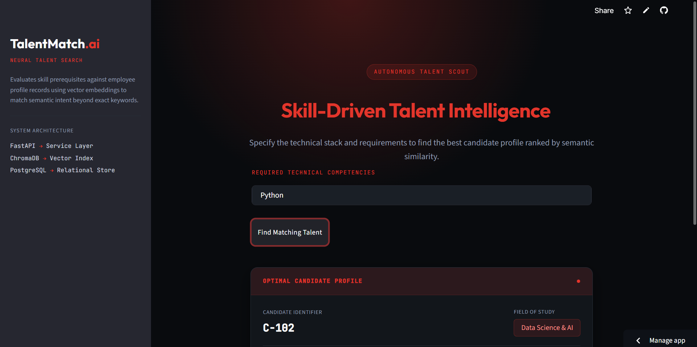

# AI Talent & Workforce Matching Agent

An AI-powered platform designed to support HR operations, recruitment, internal talent discovery, and project staffing. This system moves beyond basic CV screening by providing an end-to-end intelligent workflow utilizing Natural Language Processing (NLP), Machine Learning (ML), and Retrieval-Augmented Generation (RAG).

##  Project Overview
The platform analyzes CVs, job descriptions, project requirements, employee profiles, and availability to identify the best candidates or combinations of employees for specific roles. 

**Golden Rule:** The system never assigns, ranks, or recommends a candidate it cannot justify from actual profile data. Every match and skill gap identified is traceable to a real record, prioritizing Explainable AI (XAI) over black-box scoring.

##  Core Workflows
1. **AI Candidate Matching:** Parses CVs and matches candidates against job specifications, providing an Explainable Output summary.
2. **AI Project Team Builder:** Synthesizes complementary project teams based on natural language queries, calculating combined skill coverage and identifying team-wide skill gaps.

##  Architecture & Tech Stack

- **Frontend:** React.js (Vite), Modern CSS
- **Backend API:** Python 3.x, FastAPI
- **Database:** PostgreSQL (Relational Store)
- **Vector Store:** ChromaDB / FAISS
- **Data Science / ML:** Pandas, NumPy, Scikit-learn (Logistic Regression classifier)
- **AI Orchestration:** Custom Python Agent / LangGraph / LangChain

##  API Endpoints
- `GET /health` - Liveness check and DB connectivity.
- `GET /candidates` - List/filter candidates or employees.
- `POST /match` - Returns ranked candidates with weighted-scores and classifier probability.
- `POST /team-builder` - Returns a proposed team and combined skill coverage.
- `POST /skill-gap` - Returns missing skills and training recommendations.
- `POST /ask` - Conversational endpoint routing to the AI Agent for complex queries.

##  Data Sources
The system uses synthetic and open-source datasets to maintain privacy:
- **Employees:** Real HR records extended with skills and availability.
- **Candidates:** Resume Dataset (~960 resumes) for parsing.
- **Projects & Training:** Authored project briefs and course catalog.

##  Setup & Installation

### Backend (FastAPI)
```bash
cd backend
python3 -m venv venv
source venv/bin/activate  # On Windows: venv\Scripts\activate
pip install -r requirements.txt
uvicorn main:app --reload

```

### Frontend (React/Vite)

```bash
cd frontend
npm install
npm run dev

```

##  Evaluation

The system is evaluated using human-labeled ground truth for synthetic candidates and teams. Precision, recall, and accuracy are computed, and the trained classifier is benchmarked against a deterministic weighted-score baseline (Direct Skill: 40%, Experience: 25%, Project Relevance: 15%, Availability: 10%, Education: 10%).

## Dashboard Preview


